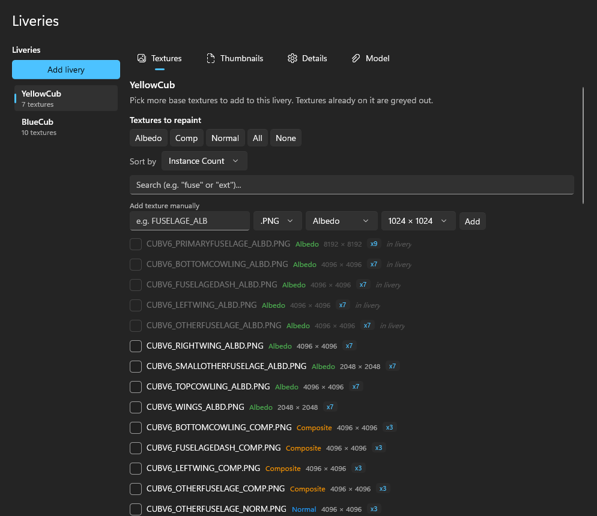
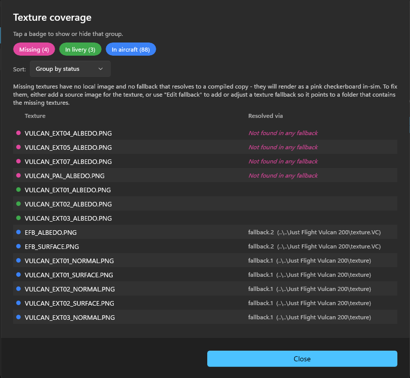
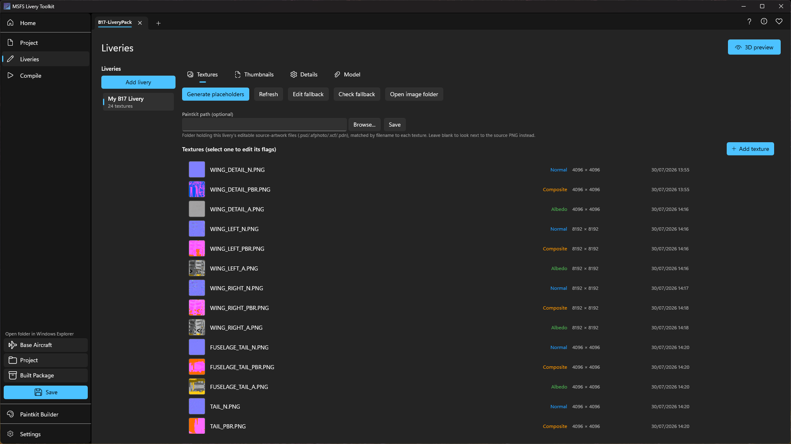
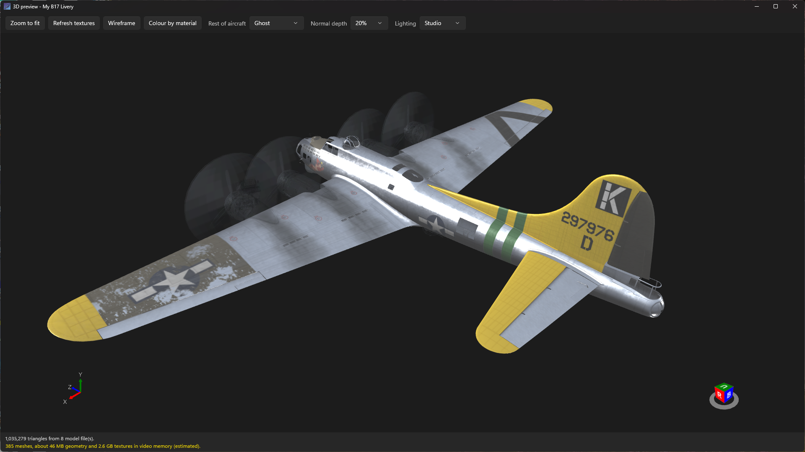

# Creating liveries
{: .no_toc }

Everything for a single livery lives on the **Edit liveries** page, organized into five tabs: **Textures**, **Thumbnails**, **Details**, **Panel**, and **Model**.

- **Textures:** defines the texture images used in your livery, including texture "flags" used by the SDK when compiling images into game assets.
- **Thumbnails:** defines the thumbnail images used in the MSFS livery selection user interface.
- **Details:** defines the parameters which populate the `aircraft.cfg` (monolithic aircraft) or `livery.cfg` (modular aircraft); this includes items such as the livery name, ATC ID, etc.
- **Panel:** controls how the simulator draws the registration number on your livery, or whether it draws one at all.
- **Model:** a placeholder tab for future functionality in the MSFS Livery Toolkit.

1. TOC
{:toc}

---

## The texture selector

When you add a livery or add textures to an existing one, the texture selector helps you pick which textures to include in your livery (i.e. which images you want to repaint). Complex add-on aircraft can contain hundreds of texture files, so the selector does the untangling for you:

- **Unified fallback scan:** flattens every texture the aircraft can reach through its `texture.cfg` fallback chains into one list, even across shared folders or entirely separate sibling aircraft directories. When the same filename exists in several folders, the highest-resolution copy is offered.
- **Instance-count badges:** a badge (e.g. ×3) shows how many base aircraft folders a file appears in. A higher instance count suggests a texture file that is probably used for liveries, since multiple copies of it exist withing the base aircraft package. Single-instance textures are more likely to be a common / shared asset and less likely to be needed in a livery.
- **Filters and quick-select:** sort by name, type, resolution, or instance count; live text filtering; and one-click category toggles (e.g. "Albedo only").
- **Smart pre-selection:** the app remembers your texture choices and custom fallback paths per base aircraft, globally, so returning to an aircraft you've painted before pre-selects your usual layout, and later liveries in a project mirror the most recently edited one. The very first livery for an aircraft you've never painted starts with nothing pre-selected, so you choose deliberately.
- **Manual add:** if you have a need for a texture file that is not found in the base aircraft scan, you can manually enter the filename, resolution, and texture type to force-add it.

### Seeing what a texture covers, before you pick it

Texture names rarely tell you which part of the aircraft they belong to, and picking from a list of names
is guesswork until you have painted that aircraft once already.

**3D coverage**, beside the texture list, opens a separate window showing the aircraft with the parts your
selected textures cover lit up. It is available both when you add a livery and when you add more textures to
an existing one, so you can see what you are taking on before you commit to painting it.

Selecting any of a material's textures lights up that section of the airframe. If you select the fuselage's
composite or its normal map rather than its colour map, you still see the fuselage. The three belong to one
material, and the app works out which ones go together by reading the aircraft's own model rather than
guessing from the file names.

Some textures sit in an aircraft's folders without being used by any of its exterior models, and a texture
you added by hand is unknown to the model too. Those cannot light anything up, so rather than leave you
wondering why nothing happened, the window tells you how many of your selected textures it could not place.

{: .note }
> This is a different question from the **3D preview** button at the top of the Liveries page, which always
> shows your own artwork on the aircraft. This one is about coverage, before any painting exists.

For aircraft with variants, choose the variant first. The button waits until you have, because the model
cannot be narrowed down without it. See [When an aircraft cannot be narrowed to one
variant]({{ '/paintkit-builder.html' | relative_url }}#when-an-aircraft-cannot-be-narrowed-to-one-variant).

### Fallback selector

A reorderable checklist controls the exact folder order the sim searches for missing textures (`fallback.1`, `fallback.2`, …), written into the livery's `texture.cfg`. The app suggests a baseline you can freely adjust with per-row **Move up / Move down** buttons. If the automatic scan can't find a path (for example a cross-SimObject reference several folders away), add it as a **manual** fallback entry - it even accepts a pasted full `fallback.N=...` line and trims it to just the path.

### Fallback checker

The **Check fallback** button is available on the **Liveries** page and from the **Edit fallback** panel. It will analyse the livery's images and texture fallbacks to ensure MSFS will find every texture the aircraft requires. Textures will be listed in one of three states:
- **Missing** (pink): the simulator will not be able to find this texture because no texture fallback path contains that file - the texture will appear as pink checkerboard in the sim. This indicates you have not set your texture fallbacks correctly.
- **In livery** (green): the texture is included with your livery.
- **In aircrafft** (blue): the texture can be found by the texture fallbacks. Use the **Resolved via** column to see which fallback path found it.

## Texture types and compile flags

The toolkit classifies each texture using the official SDK **metadata** from the base aircraft - never by filename. So a file named `..._ALBEDO.PNG` that actually carries alpha transparency is correctly treated as a Decal/Transparent map.

| Type | What it is |
|---|---|
| **Albedo** | The core colour and paint map. |
| **Composite** | A packed image of Ambient Occlusion (red channel), Roughness (green channel), and Metallic (blue channel). |
| **Normal** | Surface detail. |
| **Emissive** | Self-illuminated areas such as instruments. |
| **Decal / Transparent** | An overlay layer that relies on an alpha channel. Often use for higher resolution areas of local detail such as placards, logos or text. |

**Compile flags:** tell the SDK texture compiler how to process each image (high-quality compression, alpha preservation, mipmaps, and so on). By default the toolkit matches the exact flags the original aircraft developers used. Change anything in the flag editor and a highlight appears alongside a one-click **Reset to base** button.

## Painting your livery

Once your selection is confirmed, the workspace is populated with correctly-sized blank PNG canvases as placeholders. There are two ways to get a starting image for each texture:

- **Generate placeholders:** blank, correctly-sized canvases labelled with the filename and resolution. If you plan to use images generated from a paintkit this is the recommended approach.
- **Extract from base:** decode the base aircraft's *own already-compiled* texture back into an editable PNG, a real head start when no paintkit exists. This handles both 2020 DDS and 2024 KTX2, including MSFS's Oodle-compressed KTX2 variant that defeats most other tools. When a texture exists as more than one compiled copy in the base, you choose which instance to extract.

{: .important }
> **Your artwork is protected.** The tool never automatically overwrites an existing image file in your workspace - neither a placeholder nor an extracted image will wipe out artwork you've already put there. Once you replace a placeholder with your own painting, it is safe.

On each texture row an **Edit source artwork** action (pencil icon) will be available if the application can find a Photoshop, Affinity, Gimp or Paint.NET artwork file (`.psd`, `.afphoto`, `.xcf`, `.pdn`) where the filename matches the PNG (excluding the file extension). By default the application will check for paintkit artwork files in the same folder as the PNG images, however you can specify another folder at the top of the **Textures** panel. For more details see the section **Linking to a paintkit** below.

Use the **UV+** button to extract a UV map wireframe from the aircraft model. This image file will be created in the same folder as the other texture images, and will have a matching filename with the suffix _UV appended. Any textures that have a UV map already extracted will display a small "UV" indicator in the texture list.

Each texture row also has a **Clear image** action (eraser icon) that removes just the source PNG while keeping the texture entry, so you can swap a placeholder for an extracted image or vice versa.  It is also possible to fully remove a texture from the livery using the **Remove texture** action (trashcan icon) - this will remove the texture slot from your livery and remove the PNG from disk. You will receive a confirmation prompt when using **Clear image** or **Remove texture**.

### Working on several textures at once

A livery can easily run to dozens of textures, and doing everything one row at a time gets slow. Hold
**Ctrl** to add individual textures to your selection, or **Shift** to select a run of them, and the
actions apply to everything you have selected.

With a single texture selected nothing changes: you get the same per-texture panel and the same row
actions you always had. Select two or more and the panel closes, giving the list more room, and the
heading is replaced by the bulk actions for the whole selection.

{: .note }
> While several textures are selected, the per-row icons are deliberately unavailable. They only ever act
> on their own single row, so firing one with six textures highlighted would look like a bulk action that
> had quietly done almost nothing.

### Splitting a composite into separate images

A composite texture packs three separate things into one image: ambient occlusion, roughness and
metalness, one per colour channel. That is efficient for the sim but awkward to paint, since the image
looks like nothing in particular.

When you extract a composite from the base aircraft, you can also have those three channels written out as
separate grayscale images alongside it, named with `_AO`, `_ROUGHNESS` and `_METAL` suffixes. Edit whichever
one you actually care about, and keep the packed composite as the file the sim gets.

## Seeing your paint in 3D

Working from a flat UV map, it is easy to get a decal upside down or a stripe landing somewhere you did not
intend, and normally you would not find out until you had compiled the livery and loaded the sim.

**3D preview**, at the top of the Liveries page, opens a separate window showing your artwork on the
aircraft. Textures you have painted appear on it. Slots this livery owns but you have not painted yet are
highlighted in the accent colour, so you can see at a glance what is left to do, and the rest of the
aircraft is drawn in plain grey for context.

The preview reads the PNGs in your workspace directly, so there is nothing to compile and no wait. When you
save a repaint in Photoshop, click **Refresh textures** and it picks up the change straight away. That also
works after using **Extract from base** to fill a slot that was empty when you opened the window.

A few controls worth knowing:

- **Normal depth** changes how strongly normal maps are applied. Painted at full strength they can look
  deeper here than they do in the sim, so turn this down until it matches what you see in MSFS.
- **Lighting** offers three setups, all of which light the underside of the aircraft as well as the top, so
  you can check gear bays and belly panels.
- **Rest of aircraft** switches the unpainted parts between solid grey, a faint ghost, or hidden.

At the bottom of the window is a note of how much video memory the preview is using. Large textures add up
quickly, and it turns amber if the scene is getting heavy.

The window closes on its own when you leave the page.

{: .note }
> Parts your livery does not repaint are shown in plain grey, not in the aircraft's own paintwork. In the
> sim those parts fall back to the base aircraft's textures, so the preview answers "where does my paint
> land, and is it the right way up" rather than "what will this aircraft look like on the ramp".

## Registration numbers

The tail number MSFS paints on your aircraft is not part of your artwork. The simulator draws it at
runtime, which is why the same aircraft can show a different registration for every livery.

- **Details tab:** edit every sim-supported `[fltsim.N]` field (tail number, ATC callsign, title, and more). Fields that differ from the base default show a clear indicator and can be reverted instantly.

### Styling the registration

The **Panel tab** controls how that number is drawn: its colour, size, position and typeface, or whether
it is drawn at all. The text itself comes from **ATC id** on the Details tab, not from here.

Select **Use a custom panel.cfg to define registration number styling and visibility** to start. Your
livery gets its own panel folder, holding a complete copy of the base aircraft's panel, so the aircraft's
own instruments and avionics keep working exactly as before.

- **Hide the registration number** is the option to reach for when your artwork already includes a tail
  number. It stops the simulator drawing a second one over the top.
- **`[VPaintingN]` section** appears when an aircraft draws more than one registration, for example one on
  the fuselage and one on a cockpit placard. The exterior one is selected for you, since that is usually
  the one you mean. Edits to each are kept as you switch between them.
- **`size_mm`** is the size of the texture the number is drawn onto, where 1 mm is 1 pixel.
  **X, Y, W and H** are the area within it to paint. These should not exceed `size_mm`.
- **Text format** covers colour, style, scale, outline and background. Every box is optional: leave one
  empty to use the simulator's own default. Colours take a name such as `red` or a hexadecimal code such
  as `0xFF00FF`.

Two previews sit beside the editor and update as you type. One draws the registration itself, using the
simulator's own fitting rules, so you can see the result without loading the sim. The other shows the
real `panel.cfg` the toolkit will write, with the line you are editing called out in it.

Changes are saved as you make them. Compile the livery for them to reach the simulator.

{: .note }
> The preview uses the nearest typeface Windows has, so the text can be slightly different in size from
> what the simulator draws. Colour, position and layout are accurate.

### When the Panel tab has nothing to offer

Not every aircraft can show a livery's own registration, and the tab tells you which case you are in
rather than letting you set something that would never appear.

- **The aircraft does not use dynamic registration numbers at all.** There is nothing for a livery to
  change, so any tail number on it is part of the paintwork.
- **The aircraft supplies its registration with each of its own liveries**, using an extra model that the
  toolkit does not generate. Its own liveries show a registration and one made here cannot, so the tab
  explains that instead of offering settings that would have no effect.
- **The aircraft is modular.** Those handle registrations in a different way that is not supported yet.

{: .note }
> If an aircraft's registration is drawn by its own custom file rather than the simulator's standard one,
> you get a single options box instead of the styling controls. What those options mean is defined by the
> aircraft, so check its manual.

## Thumbnails

MSFS shows your livery in its aircraft selection screens using a small set of thumbnail images. They have
to be at exact sizes, some of them have to have a transparent background, and the set is not the same for
MSFS 2020 and 2024. The **Thumbnails tab** tracks the exact files and dimensions your sim generation
requires, and shows you what is currently there.

Producing real images used to mean leaving the toolkit: launch the sim, turn on Developer Mode, find the
Aircraft Capture Tool, take the shots, then copy the files back into your livery.

### Render thumbnails

**Render thumbnails** draws your livery on the aircraft itself and writes every thumbnail file MSFS
expects, so you do not have to capture them in the simulator.

- It writes exactly the files your project's sim generation needs, at the right sizes, with a transparent
  background on the ones that need to be cut out.
- It uses **your** paint. Anything you have not painted yet falls back to the base aircraft's own
  textures, so a half-finished livery still gives you a useful picture of where you have got to.
- For an aircraft installed in your Community folder, the simulator does not need to be running. For a
  stock or marketplace aircraft it does, with the VFS Projector started, exactly as it already does for
  everything else you do with those aircraft.

{: .warning }
> This is badged **Experimental**. It is a different renderer from the simulator's own, so expect the
> lighting and the finish to be close rather than identical. It is a shortcut past a tedious trip into
> Developer Mode, not a pixel-exact reproduction of an in-sim capture.

**Generate placeholders** is still there and unchanged: it writes plain labelled images, and only for
files that are missing. It is the fallback for when an aircraft's geometry cannot be read.

**Replace…** still lets you drop in a real image of your own, and a size mismatch warns but lets you
proceed. Images you add by hand are never overwritten.

### Leaving parts out of a render

Aircraft carry plenty of geometry you would not want in a livery thumbnail: ground power units, chocks,
crew figures, covers, tow bars, and on some aircraft a pilot sitting in the cockpit. **Edit object
visibility** opens the aircraft in 3D and lets you leave any part out of the render.

- Click a part in the list to find it on the model, or hover the model to see what a part is called.
- The display switch controls what you are looking at: **Both** shows everything, with hidden parts
  ghosted; **Only visible** shows just what will actually be rendered; **Only hidden** shows just the
  parts you have taken out, which is the quickest way to check you have not hidden something by mistake.
- Your choices are remembered per aircraft, so you only do this once no matter how many liveries you
  paint for it.

## Linking to a paintkit
It is possible to directly open source artwork files if the MSFS Livery Toolkit can find an associated file; currently supported formats are Photoshop, Affinity, Gimp and Paint.NET. The search logic is as follows:
 1. **Custom path to a specific artwork file**: You can browse to any supported file type in any folder. This is set per texture slot, using the pane on the right side of the application which appears when a texture slot is selected in the **Liveries** tab. This is useful if the aircraft developer provides paintkit files which don't have the same naming convention as the texture images.
 2. **Filename match in the folder specified in the livery "Paintkit path" field**: You choose a path, the toolkit looks for filenames that match the PNG texture name. For example if the texture PNG filename is `FW190_EXTERIOR_1001_ALB.PNG`, then the application will automatically find `FW190_EXTERIOR_1001_ALB.psd` or `FW190_EXTERIOR_1001_ALB.afphoto` or `FW190_EXTERIOR_1001_ALB.xcf` or `FW190_EXTERIOR_1001_ALB.pdn`.
 3. **Filename match in the same folder as the PNG files**: If no "Paintkit path" field is set, the application will search for matching filenames in the same folder as the PNG files, using the name matching logic described above.
