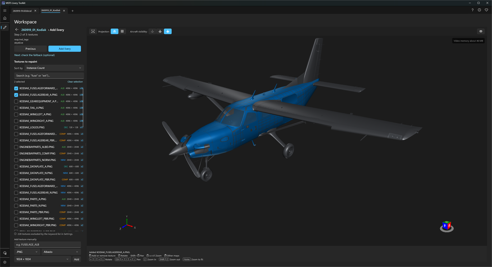
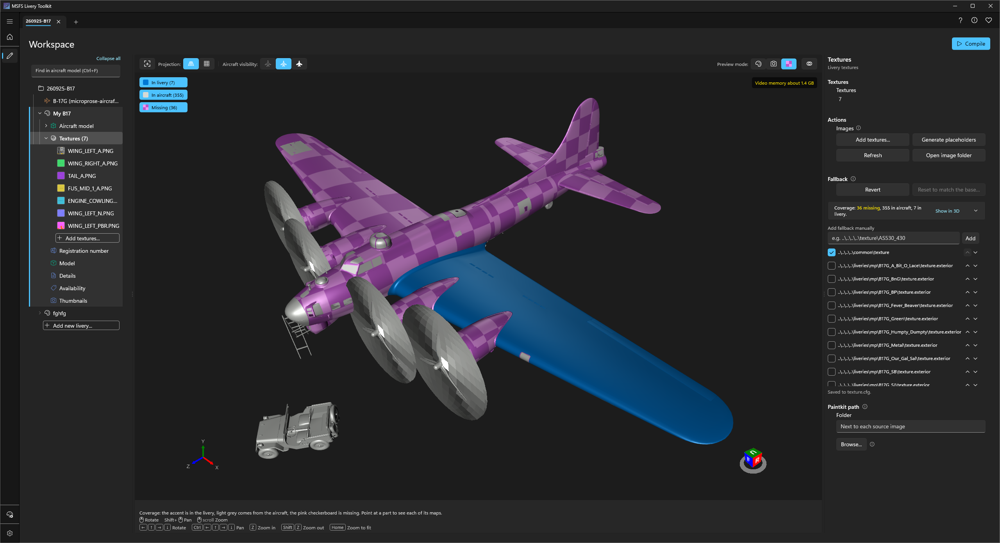
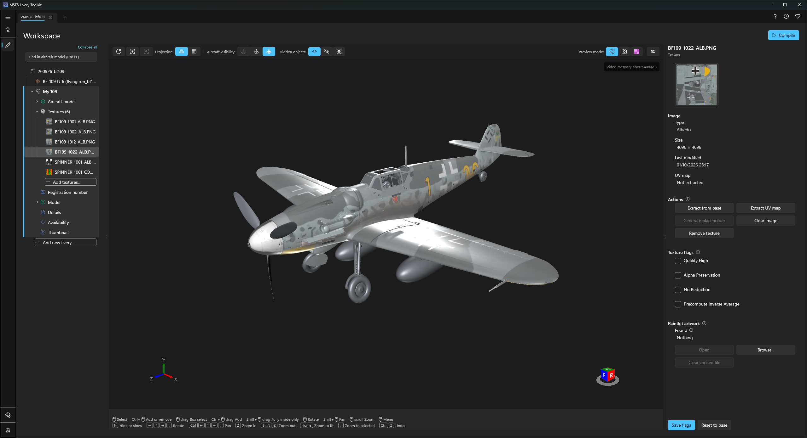
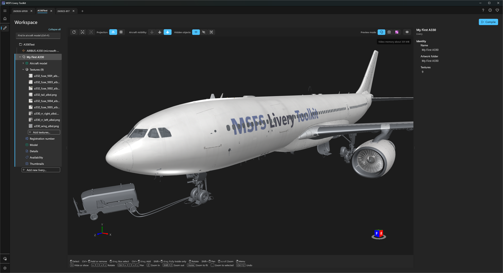
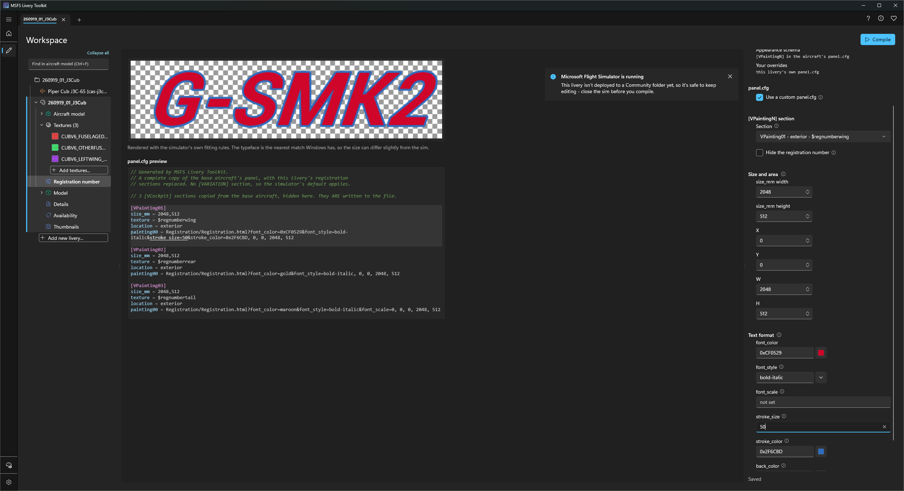

# Creating liveries
{: .no_toc }

A livery lives under its row in the [Workspace]({{ '/workspace.html' | relative_url }}) tree, with one node for each part of it:

- **Textures:** the images your livery repaints, and the compile flags the SDK uses to turn them into game assets.
- **Thumbnails:** the images MSFS shows for your livery in its aircraft selection screens.
- **Registration number:** how the simulator draws the registration number on your livery, or whether it draws one at all. Works on both monolithic and modular aircraft.
- **Model:** your own 3D decal model, merged with the aircraft's. See [Mesh liveries]({{ '/mesh-liveries.html' | relative_url }}).
- **Details:** the fields written into `aircraft.cfg` (monolithic aircraft) or `livery.cfg` (modular aircraft), such as the livery's title and ATC id.
- **Availability:** on modular aircraft, which of the aircraft's configurations your livery appears under.

1. TOC
{:toc}

---

## Adding a livery

Select **Add new livery...**, the last row under the project. Adding a livery is a guided task in three steps, and the aircraft stays in 3D beside you the whole way. **Previous** and **Next** move between the steps without losing anything; **Esc** or the back arrow cancels.

1. **Details and variant.** Title, ATC id, creator, paintkit path and, on modular aircraft, the configuration you are painting. The viewport shows that configuration as you choose it. Each livery in a project needs a title of its own: MSFS uses the title to tell liveries apart, so a title another livery in the project already uses is refused.
2. **Textures.** Choose which of the aircraft's textures to repaint. See [Choosing textures](#choosing-textures).
3. **Fallback** (optional). The viewport colours the aircraft by coverage, so you can see whether anything would turn pink. See [Texture fallbacks](#texture-fallbacks).

**Add livery** is available from the textures step onwards, so the fallback step is yours to skip. Once the livery is added it is loaded, ready to paint.

{: .note }
> A livery titled the same as one in another project, or in another add-on, can still clash in the simulator, and the app cannot check that far. A creator prefix in the title avoids it, as the SDK recommends.

---

## Choosing textures

Complex aircraft can contain hundreds of texture files, so the texture list does the untangling for you:

- **Unified fallback scan:** flattens every texture the aircraft can reach through its `texture.cfg` fallback chains into one list, even across shared folders or entirely separate sibling aircraft folders. When the same filename exists in several folders, the highest-resolution copy is offered.
- **Instance-count badges:** a badge (for example ×3) shows how many of the base aircraft's folders a file appears in. A higher count suggests a texture that liveries repaint, since multiple copies of it exist in the package. Single-instance textures are more likely to be shared assets.
- **Sort and search:** **Sort by** name, type, resolution or instance count, and search by part of a name (for example "fuse" or "ext"). **Clear selection** starts again. Textures matching the exclude list in [Settings]({{ '/configuration.html' | relative_url }}) are left out, and the list says how many.
- **Smart pre-selection:** the app remembers your texture choices per base aircraft, so returning to an aircraft you have painted before pre-selects your usual layout, and later liveries in a project mirror the most recently edited one. The very first livery for an aircraft you have never painted starts with nothing selected, so you choose deliberately.
- **Add texture manually**, below the list, force-adds a texture the scan did not find: enter its filename, resolution and type.

### Picking on the aircraft

Texture names rarely say which part of the aircraft they paint, so the aircraft is right beside the list. Select a texture and the parts it covers light up. Or work the other way round: **click a part** to add its texture, and click it again to take it out.

- Selecting any of a material's textures lights up its parts. The colour, composite and normal maps of one material belong together, and the app works that out from the aircraft's own model rather than from the file names.
- **Right-click a part** to choose its composite or normal map instead of its colour map, or to pick one of several overlapping layers. Some aircraft weather their paint with dirt or frost textures over the whole airframe, and the menu lists every layer underneath.
- The interior is hidden while you pick, so you can reach the outside of the aircraft.

Some textures sit in an aircraft's folders without being used by any of its exterior models, and a texture you added by hand is unknown to the model too. Those cannot light anything up, so the app tells you how many of your selected textures it could not place.

For aircraft with variants, choose the variant first: the view cannot be narrowed to the right parts without it. See [When an aircraft cannot be narrowed to one variant]({{ '/paintkit-builder.html' | relative_url }}#when-an-aircraft-cannot-be-narrowed-to-one-variant).

### Adding more textures later

Select **Add textures...**, the last row in a livery's Textures folder. The texture list takes the tree's place and the viewport is set up for picking: parts your livery already paints stand out from the ones you are about to add. You cannot remove an existing texture from here; use **Remove texture** on the texture itself. When you finish or cancel, the viewport goes back to exactly how you left it.

Another way in: select a part on the aircraft and open the **material chip** at the end of the [breadcrumb]({{ '/workspace.html' | relative_url }}#the-breadcrumb). A texture that is not in your livery yet opens Add textures with it already selected.

---

## Texture fallbacks

When the simulator cannot find a texture in your livery, it searches a list of other folders, the fallbacks written into your livery's `texture.cfg`. Get them wrong and those parts turn into a pink checkerboard.

Select a livery's **Textures** folder: the **Fallback** section holds the list, in the order the simulator searches it.

- It **saves as you change it**. **Revert** undoes this visit's changes, and **Reset to match the base aircraft** puts back the list the base aircraft uses.
- Folders taken from the aircraft's own texture setup carry a **Base aircraft** label. Some of them are the simulator's own shared folders, such as `..\..\..\..\texture\detailMap` for frost and detail textures, which exist in no package on disk. They are selected for every new livery, because leaving one out turns those parts pink.
- **Your project's other liveries** are offered as fallback folders too, and the coverage check counts them.
- If the automatic scan cannot find a path (for example a reference several folders away), add it with **Add fallback manually**. It even accepts a pasted `fallback.N=...` line and trims it to just the path.

### Checking coverage

A line at the top of the Fallback section says whether every texture the aircraft needs will be found. Open it for the full list, with each texture in one of three states:

- **Missing**: no fallback folder holds this texture, so it will render as a pink checkerboard.
- **In livery**: your livery includes it.
- **In aircraft**: a fallback folder finds it. **Resolved via** shows which one.

**Show in 3D**, on the coverage line, switches the viewport to **Coverage preview** (also on the viewport's toolbar), which colours the aircraft the same way: your livery's parts in the accent colour, the aircraft's own in light grey, and anything missing in the simulator's pink checkerboard. Point at a part to see each of its maps. The legend doubles as a filter: select a group to hide or show its parts.

{: .note }
> If a livery's built folder has gone missing (deleted by hand, for example), the app refuses to save its fallback and Compile refuses to build it, rather than writing into a folder that no longer holds the livery's files.

---

## Choosing which configurations show your livery

Modular aircraft are built from parts, and the same airframe is often sold in several configurations: a cargo pod, floats, a different engine, and so on. MSFS decides which of your liveries to offer under each configuration using tags written into `livery.cfg`, and getting them wrong can make a livery invisible in the simulator.

When you add a livery to a modular aircraft, the app offers a curated list of configurations drawn from tags the aircraft's own liveries already use. If none of those fit, select **Customise tags** to see the aircraft's whole tag vocabulary as a set of checkboxes, alongside a table listing every configuration the aircraft supports and marking which ones your choice reaches.

If the aircraft uses no tags at all, leave the field blank. The app tells you so rather than suggesting something that would hide your livery under every configuration.

**Changing this later:** the **Availability** node changes which configurations a livery appears under, without deleting and re-adding it, which would also delete its artwork. Select **Save availability** when you are done. Narrowing the configurations does not delete any textures, even ones only used by configurations you removed. Those stay in your livery, dimmed and marked **not used**, in case you widen the availability again later.

If a livery's tags do not match any configuration the aircraft offers, the app tells you, and so does the build screen. This does not block compiling, but such a livery would never appear in the simulator.

---

## Texture types and compile flags

The toolkit classifies each texture using the official SDK **metadata** from the base aircraft, refined by checking how the aircraft's own materials actually use it, never by filename. A file named `..._ALBEDO.PNG` that happens to carry alpha for an unrelated reason is not treated as a Decal / Transparent map; only textures genuinely bound to a decal or transparent material are.

| Type | What it is |
|---|---|
| **Albedo** | The core colour and paint map. |
| **Composite** | A packed image of Ambient Occlusion (red channel), Roughness (green channel), and Metallic (blue channel). |
| **Normal** | Surface detail. |
| **Emissive** | Self-illuminated areas such as instruments. |
| **Decal / Transparent** | An overlay layer that relies on an alpha channel. Often used for higher resolution areas of local detail such as placards, logos or text. |

**Compile flags** tell the SDK texture compiler how to process each image (high-quality compression, alpha preservation, mipmaps, and so on). They are in each texture's **Texture flags** section. By default the toolkit matches the exact flags the original aircraft developers used. Change anything and a marker appears beside it with a **Reset**, and **Reset to base** at the bottom of the panel puts every flag back. Select **Save flags**, or press **Ctrl+S**, to keep your changes.

---

## Painting your livery

Once your livery is added, its Textures folder lists every texture it repaints, each with a small thumbnail of your artwork. There are two ways to get a starting image for each texture:

- **Generate placeholder:** a blank, correctly-sized canvas labelled with the filename and resolution. If you plan to use images from a paintkit, this is the recommended approach.
- **Extract from base:** decodes the base aircraft's own compiled texture back into an editable PNG, a real head start when no paintkit exists. This handles both 2020 DDS and 2024 KTX2, including MSFS's Oodle-compressed KTX2 that defeats most other tools. When a texture exists as more than one compiled copy in the base, you choose which one to extract.

{: .important }
> **Your artwork is protected.** The tool never automatically overwrites an existing image file in your workspace. Neither a placeholder nor an extracted image will wipe out artwork you have already put there.

**Select the Textures folder** for the livery-wide actions: **Add textures...**, **Generate placeholders** for every texture without an image, **Refresh**, **Open image folder**, and the **Paintkit path**.

**Select a texture** for its preview, its state (for example "not used" or a size that differs from the base aircraft's), its **Texture flags**, its **Paintkit artwork**, and its actions:

- **Extract from base** and **Generate placeholder**, as above.
- **Extract UV map** writes a wireframe of the texture's UV layout, taken from the aircraft's model, beside your PNG with `_UV` added to its name.
- **Clear image** removes just the PNG while keeping the texture in your livery, so you can swap a placeholder for an extracted image or the other way round.
- **Remove texture** takes the texture out of your livery and deletes its PNG.

You are asked before anything is cleared or removed. **Right-click** any texture for the same actions without opening its properties. After Extract from base, Generate placeholder or Clear image, the viewport updates by itself.

### Working on several textures at once

Hold **Ctrl** to add individual textures to your selection, or **Shift** to select a run of them. The properties panel then shows how many are selected and the actions for all of them at once.

### Splitting a composite into separate images

A composite texture packs three separate things into one image: ambient occlusion, roughness and metalness, one per colour channel. That is efficient for the sim but awkward to paint.

When you extract a composite from the base aircraft, you can also have those three channels written out as separate grayscale images alongside it, named with `_AO`, `_ROUGHNESS` and `_METAL` suffixes. Edit whichever one you care about, and keep the packed composite as the file the sim gets.

### Linking to a paintkit

A texture's **Paintkit artwork** section finds the Photoshop, Affinity, GIMP or Paint.NET file (`.psd`, `.afphoto`, `.xcf`, `.pdn`) you paint it in, and **Open** opens it in its program. The search runs in this order:

1. **A file you chose for this texture.** Select **Browse...** to choose any supported file in any folder, and **Clear chosen file** to go back to the automatic search. Useful when an aircraft's own paintkit files are not named like its textures.
2. **A matching filename in the livery's Paintkit path**, set on the Textures folder. For a texture `FW190_EXTERIOR_1001_ALB.PNG`, the app finds `FW190_EXTERIOR_1001_ALB.psd`, `.afphoto`, `.xcf` or `.pdn`. Files made by the [Paintkit Builder]({{ '/paintkit-builder.html' | relative_url }}) are found too, since it names its output `FW190_EXTERIOR_1001_ALB_Paintkit.psd`. A file named exactly after the texture wins over a `_Paintkit` one.
3. **A matching filename beside the PNG**, when no Paintkit path is set.

### Seeing your paint in 3D

The viewport shows your artwork on the aircraft as you work, reading the PNGs in your workspace directly, so there is nothing to compile and no wait. After saving a repaint in your paint program, select **Refresh** on the viewport's toolbar. See [The viewport]({{ '/workspace.html' | relative_url }}#the-viewport) for everything it can do.

---

## Registration numbers

The tail number MSFS paints on your aircraft is not part of your artwork. The simulator draws it at runtime, which is why the same aircraft can show a different registration for every livery. The text itself is the livery's **ATC id**, set when you add the livery and editable on the **Details** node.

A summary at the top of the **Registration number** node answers four questions for any aircraft, monolithic or modular: what the registration says, what it is drawn onto, how it looks, and what this livery may change.

### Styling the registration

On monolithic aircraft, the node controls how the number is drawn: its colour, size, position and typeface, or whether it is drawn at all.

Select **Use a custom panel.cfg** to start. Your livery gets its own panel folder, holding a complete copy of the base aircraft's panel, so the aircraft's own instruments and avionics keep working exactly as before.

- **Hide the registration number** is the option to reach for when your artwork already includes a tail number. It stops the simulator drawing a second one over the top.
- **`[VPaintingN]` section** appears when an aircraft draws more than one registration, for example one on the fuselage and one on a cockpit placard. The exterior one is selected for you, since that is usually the one you mean. Edits to each are kept as you switch between them.
- **`size_mm`** is the size of the texture the number is drawn onto, where 1 mm is 1 pixel. **X, Y, W and H** are the area within it to paint. These should not exceed `size_mm`.
- **Text format** covers colour, style, scale, outline and background. Every box is optional: leave one empty to use the simulator's own default. Colours take a name such as `red` or a hexadecimal code such as `0xFF00FF`.

Two previews update as you type. One draws the registration itself, using the simulator's own fitting rules, so you can see the result without loading the sim. The other shows the real `panel.cfg` the toolkit will write, with the line you are editing called out in it. Changes are saved as you make them. Compile the livery for them to reach the simulator.

{: .note }
> The preview uses the nearest typeface Windows has, so the text can be slightly different in size from what the simulator draws. Colour, position and layout are accurate.

### Modular aircraft

Modular aircraft do not get a `panel.cfg` of their own. Instead the node overrides named parameters in the base aircraft's own registration through `livery.cfg`, when the aircraft's own painting allows it: a list of the parameters you can set, if any, appears with the aircraft's own default for each shown alongside. When the aircraft does not allow it, the node explains why instead of offering settings that would have no effect.

As with monolithic aircraft, these settings control how the registration looks, not what it says. The simulator's own tail number setting overrides the ATC id if one is set there.

### When there is nothing to offer

Not every monolithic aircraft can show a livery's own registration, and the node tells you which case you are in:

- **The aircraft does not use dynamic registration numbers at all.** There is nothing for a livery to change, so any tail number on it is part of the paintwork.
- **The aircraft supplies its registration with each of its own liveries**, using an extra model that the toolkit does not generate. Its own liveries show a registration and one made here cannot.

{: .note }
> If an aircraft's registration is drawn by its own custom file rather than the simulator's standard one, you get a single options box instead of the styling controls. What those options mean is defined by the aircraft, so check its manual.

---

## Details

The **Details** node lists every field of the livery's `[fltsim.N]` section (monolithic) or `livery.cfg` (modular) that the simulator supports: title, ATC id, callsign and more, in the file's own order. Fields that differ from the base aircraft are marked and can be put back with **Reset**. A few are set by the toolkit and shown for reference only. Select **Save details**, or press **Ctrl+S**, to keep your changes.

---

## Thumbnails

MSFS shows your livery in its aircraft selection screens using a small set of thumbnail images. They have to be at exact sizes, some of them with a transparent background, and the set is not the same for MSFS 2020 and 2024. The **Thumbnails** node lists the exact files your sim generation requires and shows what is currently there.

### Render thumbnails

**Render thumbnails** draws your livery on the aircraft and writes every thumbnail file MSFS expects, so you do not have to capture them in the simulator's Developer Mode.

- It writes exactly the files your sim generation needs, at the right sizes, with a transparent background on the ones that need it.
- It uses **your** paint. Anything you have not painted yet falls back to the base aircraft's own textures, so a half-finished livery still gives you a useful picture.
- For an aircraft in your Community folder, the simulator does not need to be running. For a stock or Marketplace aircraft it does, with the VFS Projector started, as for everything else you do with those aircraft.

{: .warning }
> This is badged **Experimental**. It is a different renderer from the simulator's own, so expect the lighting and the finish to be close rather than identical.

**Generate placeholders** writes plain labelled images, only for files that are missing. **Replace...** drops in an image of your own; a size mismatch warns but lets you proceed. Images you add by hand are never overwritten.

### Leaving parts out of a render

Aircraft carry plenty of geometry you would not want in a thumbnail: ground power units, chocks, crew figures, covers and tow bars. Clear the **camera** column on a part in the Aircraft model node to leave it out, or select **Show in Thumbnail Preview** to see exactly what a render will include and press **H** to hide parts from it. Your choices are remembered per aircraft. See [Hiding parts]({{ '/workspace.html' | relative_url }}#hiding-parts).
