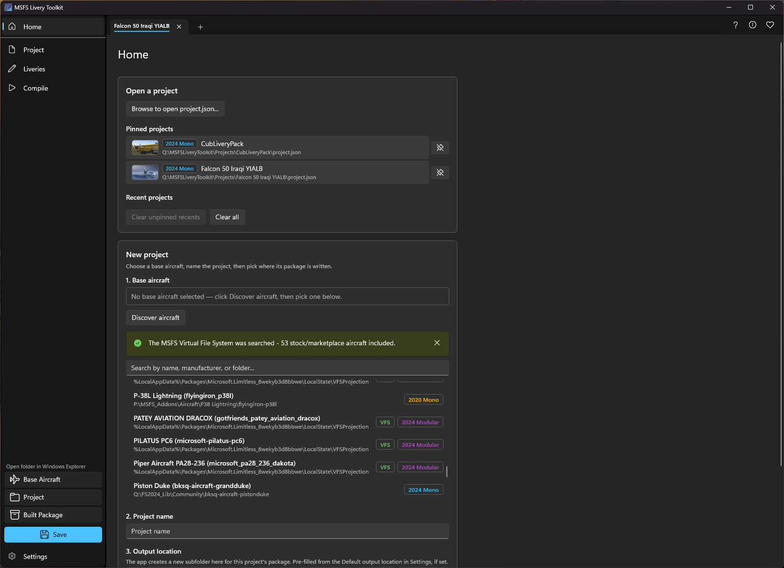

# Getting started
{: .no_toc }

1. TOC
{:toc}

---

## Download and installation

Grab the latest portable release using the button above. There is no installer: unzip the download, then double-click **MSFS Livery Toolkit** at the top of the extracted folder to start the app. Everything else the app needs lives in the `app` subfolder next to it — you don't need to open that folder or run anything inside it. You'll probably get a Windows warning about an unsigned app, so you'll need to click **More Info > Run Anyway** to proceed, if you are comfortable to do so. See **https://theflaknine.github.io/MSFS-Livery-Toolkit/trust-and-safety.html** for more details on unsigned applications.

## First-run setup

Before you can discover aircraft or compile anything, open the **Settings** page and set up:

- **Aircraft source folders:** the folders scanned for installed base aircraft. Use **Detect Community folders** to find them automatically, and / or **Add folder…** to point at a Community / add-on-linker location manually.
- **At least one MSFS SDK path:** (2020 or 2024). The app auto-detects the default install locations; confirm or correct them here.

If either is missing, the Home page shows a **"Let's get you set up"** banner with a shortcut to Settings, and *Discover aircraft* stays disabled until it's resolved.

## Creating a project

On the **Home** page:
1. (Optional) If you want to include stock or Marketplace aircraft you must first mount the MSFS Virtual File System (VFS). View MSFS SDK documentation [here](https://docs.flightsimulator.com/msfs2024/html/2_DevMode/Menus/Tools/The_Virtual_File_System.htm) for instructions. Aircraft located in the VFS will display a green "VFS" badge at the next step.   
2. Click **Discover aircraft** to populate the base-aircraft list, then pick one. Search by title, manufacturer, or folder name. A colour-coded **profile badge** shows whether it's 2020 Mono, 2024 Mono, or 2024 Modular. *Note we are referring to non-modular aircraft as "monolithic" since, hence the label "mono".*
    
    
    
3. Name your project.
4. Confirm the **output location**. The app suggests a folder name following MSFS naming conventions (`<company>-aircraft-<name>-livery-<project>`), but it's fully editable, and a live preview shows the exact path that will be created. You can optionally choose to create the output folder as a sibling folder of the base aircraft folder.
5. Click **Create**. This makes an empty project with no liveries yet.
6. Switch to **Liveries** and click **Add livery** to build your first one.

## The two locations of a project

Every project lives in two places on disk:

- **Workspace:** holds the project save file and your loose, editable PNG artwork. Safe to move or rename; the app always finds the project relative to wherever the `project.json` is opened from.
- **Deployment target:** the final compiled package the simulator reads.

Open either at any time from the **Open folder in Windows Explorer** shortcuts (Base Aircraft / Project / Built Package) in the navigation pane footer, next to **Save**.

## Opening and pinning projects

The Home dashboard keeps two lists:

- **Pinned projects:** projects you want to make available for quick access, they will not drop off the Recents list.
- **Recent projects:** an automatically maintained, capped history. Clear unpinned recents or all history with the appropraite **Clear** buttons.

Each row shows a small thumbnail preview derived from the project's first livery.
