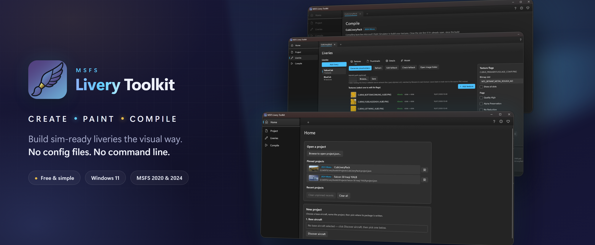

# MSFS Livery Toolkit
{: .fs-9 }

Create Microsoft Flight Simulator liveries - scaffold, paint, and compile sim-ready assets from one free Windows app.
{: .fs-6 .fw-300 }

[Download the latest release](https://github.com/theflaknine/MSFS-Livery-Toolkit/releases){: .btn .btn-primary .fs-5 .mb-4 .mb-md-0 .mr-2 }
[View on GitHub](https://github.com/theflaknine/MSFS-Livery-Toolkit){: .btn .fs-5 .mb-4 .mb-md-0 }

 
---

## What it does

The toolkit takes you through the whole livery pipeline:

1. **Create:** pick an installed base aircraft, and the app detects its profile (2020 monolithic, 2024 monolithic, or 2024 modular) and scaffolds a correct, sim-ready livery package.
2. **Work:** choose which of the base's textures to repaint, generate correctly-sized blank canvases *or* extract the base's own compiled textures back to editable PNGs, and edit each texture's compile flags.
3. **Compile:** turn your PNG artwork into sim-ready DDS/KTX2 using the official MSFS SDK, build a full package ready to use in your community folder, then regenerate `layout.json` and launch the sim to test.

A project is a single deployable package that can hold one or many liveries sharing the same base aircraft.

## Get started

- [Getting started](getting-started): first-run setup and creating your first project
- [Creating liveries](creating-liveries): textures, flags, and painting
- [Compiling](compiling): building and testing your package
- [Configuration](configuration): SDK paths, source folders, and settings

## Requirements

- Windows 11 (64-bit)
- Microsoft Flight Simulator 2020 and/or 2024
- The matching MSFS SDK (installed through the sim's Dev Mode)

(MSFSLayoutGenerator, which the app also needs, is now **bundled** — nothing to download.)

## How it was built

- **Hobbyist Built:** I am a livery painter, not a professional software developer. This toolkit was built to automate the tedious backend chores of package layout so we can all spend more time creating.
- **AI-Assisted Architecture:** Because I lacked the coding experience to build a full Windows application from scratch, I used a personally funded Claude Pro subscription to bridge the gap.
- **Human-Driven Logic:** This is not unthinking "AI slop." Every workflow step, simulator profile rule, and configuration logic choice was explicitly designed by me based on real flight-sim SDK behavior and manually verified at every milestone. Countless man-hours have gone into this project, even with Claude writing the code.
- **Always Free:** Leveraging these modern tools made it possible to build a polished desktop utility in my spare time and release it completely free to the flight simulation community. I will never monetize this app (besides entirely optional donations) or lock functionality behind a paid-for tier.

## Support the project
I’ve funded this project out of my own pocket with a Claude Pro subscription. I will never monetize this application or offer a premium tier - I’m developing it as a perpetually free tool for the livery painting community. However, to keep enhancing and developing it, I would be grateful for any donations via my [Buy Me a Coffee](https://buymeacoffee.com/flaknine) page.
