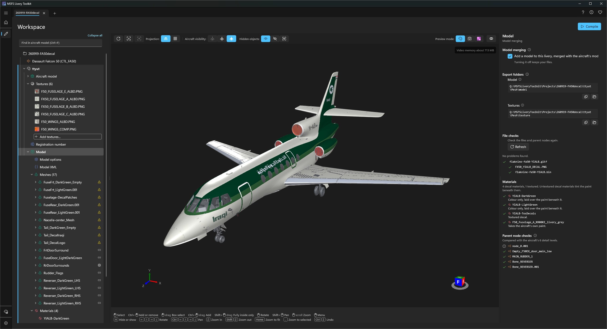
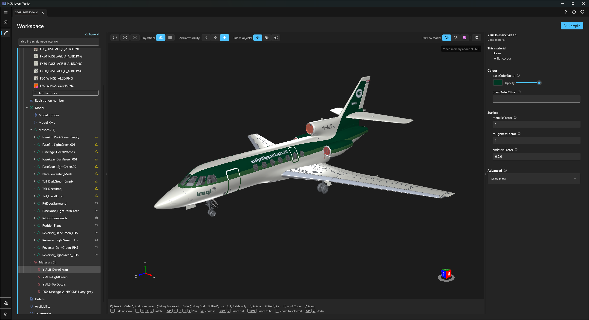

# Mesh liveries
{: .no_toc }

A livery does not have to be paint alone. A **mesh livery** also carries a small 3D model of its own, merged into the aircraft's model by the simulator: stripes, lettering or a registration as real geometry that stays crisp at any distance, or an extra part such as an aerial or a pod. Decals can even ride the aircraft's moving parts, so a stripe across a door opens with the door.

You build the model in a 3D modelling tool that exports glTF for MSFS. Blender is a great free choice, and it is the one this page uses in its examples. The toolkit checks the model, compiles it with your livery, and writes everything the simulator needs to merge it.

1. TOC
{:toc}

---

## Which aircraft

Mesh liveries work on **MSFS 2024 aircraft**, both monolithic and modular, including stock and Marketplace aircraft read through the Virtual File System. MSFS 2020 aircraft can carry mesh liveries too, but the toolkit does not build them for 2020 yet. Aircraft the simulator protects are not supported. See [Supported aircraft]({{ '/supported-aircraft.html' | relative_url }}).

---

## Before you start: get the aircraft's moving-part nodes

For a decal to follow a moving part, it has to be parented to the aircraft's own node for that part, with the same name and in the same place. The [Paintkit Builder]({{ '/paintkit-builder.html' | relative_url }}) gives you those nodes as two files, and each has its own job:

1. Build a **3D paintkit** with **Include parent nodes for merged models** and **Also write parent nodes as a separate file** both selected.
2. **Use the paintkit model as your reference.** Import it into Blender to see how the aircraft is put together: which parts hang under which node, so you know which node a door or a rudder moves with.
3. **Build your livery in the parent nodes file.** It holds just the aircraft's nodes, for every part of the aircraft, already in the right place, and none of its geometry. Model your decals in it and parent each one under the node it should follow. A decal parented to nothing stays still.
4. Export that file as your livery's model.

Working in the parent nodes file keeps the aircraft's own geometry out of your livery's model, and gives you every node whatever textures you chose for the paintkit.

---

## Modelling tips

- **Export with an MSFS glTF exporter**, such as the one for Blender. It gives every node the identifier the simulator merges by. A file without those identifiers, such as one from a general-purpose glTF exporter, is reported in the File checks, because its decals may not follow moving parts.
- **Use a decal material** for anything laid over the paint, such as stripes and lettering. It blends over the aircraft's surface instead of fighting it. An ordinary material is right for a solid part, such as an aerial.
- **Lift geometry slightly off the skin**, or give it a decal material, or it can flicker in the simulator where it meets the aircraft's surface.
- **One model per livery.** If the model folder holds two, the build stops rather than guessing which you meant.

---

## Adding a model to a livery

Select the livery's **Model** node in the [Workspace]({{ '/workspace.html' | relative_url }}) tree, then select **Add a model to this livery, merged with the aircraft's model**. Turning it off later keeps your files.

**Export folders** shows two folders, each with an **Open** button:

- **Model**: export the `.gltf` and its `.bin` here.
- **Textures**: where your model's textures must already be **before** you export. See below.

{: .important }
> **This step is very easy to get wrong.** Blender does **not** copy your textures into the Textures folder when you export. The exporter only writes down where each image already is. So the images must be in that folder, and Blender must be pointing at them there, before you export:
>
> 1. Copy every texture your model uses into the **Textures** folder.
> 2. In Blender, point each image at its copy in that folder (in the Image Editor, **Image > Replace**, or the image's file path in its properties).
> 3. Then export the model into the **Model** folder.
>
> If Blender still points at the images somewhere else, such as your artwork folder, the **File checks** flag every image that is not in the Textures folder. Fix it in Blender and export again before you compile.

{: .warning }
> Keep your model and its textures on the same drive. The exporter writes each image as a path relative to the model, and a relative path cannot cross drive letters, so an image on another drive is silently left out and the material draws white in the simulator. Keeping them in the Textures folder above avoids this.

After each export, select **Refresh** to check the files again.

- **File checks** lists the model, its buffer and every texture it uses, and says if anything is missing or was not written by the MSFS exporter.
- **Parent node checks** lists the nodes your geometry hangs under and whether each matches the aircraft's own node by name and position. Select one to outline the decals hanging from it. These are warnings only and never stop a build.
- **Meshes**, a folder under the Model node, lists each mesh in your model with the node it is parented to. Select one to outline it in the viewport.

### Seeing it on the aircraft

The viewport draws your model on the aircraft as you work. After re-exporting from Blender, select **Refresh** on the viewport's toolbar.

**Model alignment**, in Display options, chooses how your model is placed:

- **Global** draws it exactly as you exported it, so a decal attached to the wrong place looks wrong here too.
- **Aircraft nodes** moves each of your parent nodes onto the aircraft's own node, which is where the simulator's merge puts it.

---

## Changing a material's colour at build time

The **Materials** folder under the Model node lists each material in your model. Select one to change what it produces when the livery is built: its colour above all, so red stripes need no re-export of a green model, then its surface, and under **Advanced**, how a decal combines with the paint underneath.

Your own file is never changed. The toolkit applies these settings to a copy while it builds, and **Reset** on any row puts back what you exported. On a textured decal the colour multiplies the texture, so it tints rather than replaces.

---

## Monolithic aircraft: model options and merged parts

On a monolithic aircraft the Model node has two more nodes, each with a preview of the file the toolkit will write:

- **Model options** holds the four `[model.options]` settings, copied from the aircraft into your livery's `model.CFG`. Change one only if your livery needs to differ.
- **Model XML** lists the extra models the aircraft merges over its own, under each detail level. All are kept unless you clear one, which is what you want when your model replaces it, such as a backing plate behind a registration. Your own model can be left out of individual detail levels, which is how you drop it from the most distant ones.

---

## Modular aircraft: one model, split by part

A modular aircraft is built from parts, and the simulator adds a livery's model to each part separately. So the build splits your one model for you: each mesh goes to the part that owns the node it is parented to, and a mesh parented to nothing goes to the main part and stays still.

The **Parts** table on the Model node shows where each mesh will go. Some parts of an aircraft cannot take a livery's model at all; the table says so, and meshes parented there are left out of the build.

---

## Compiling

Compile as usual. The toolkit compiles your model and its textures with the livery, writes the merge files, and points the livery at them. On a monolithic aircraft that sets the livery's `model` field, which is why it is locked on the Details node while a model is enabled.

Check the result in the simulator: open and close the doors and move the controls to confirm every decal follows its part.
