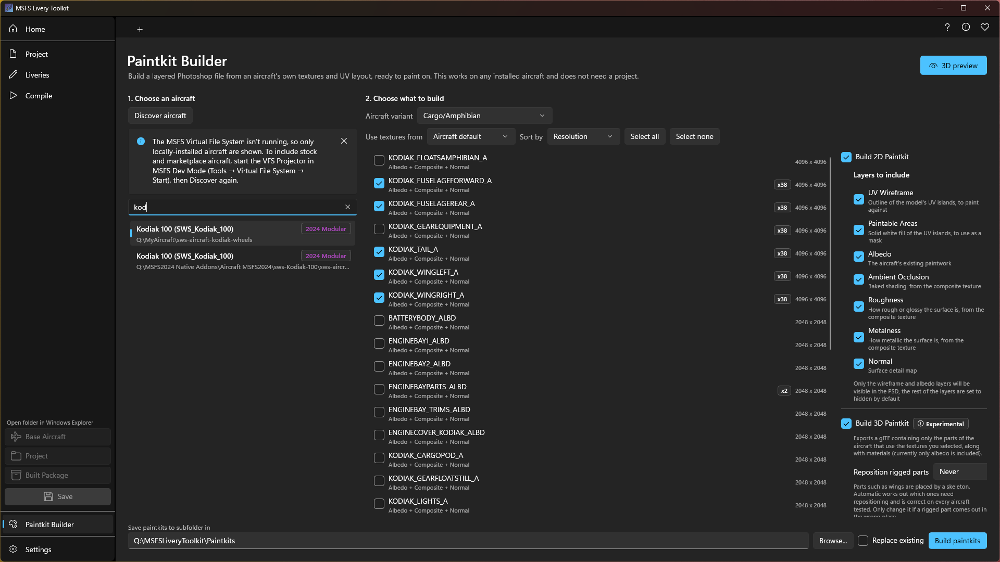
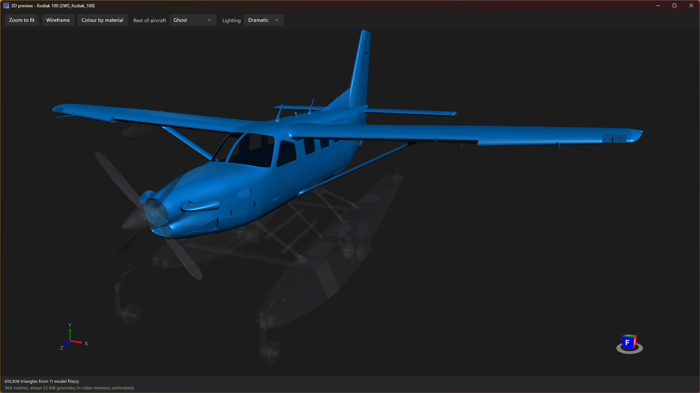

# Paintkit Builder

Many aircraft never ship a paintkit. Without one you are painting blind: no idea where the panel lines
fall on the texture sheet, no idea which part of the image is the tail, and nothing underneath to trace.

The Paintkit Builder solves that by building a paintkit **from the aircraft itself**. It reads the
aircraft's own compiled textures and its 3D model, and gives you two ways to work: a layered Photoshop
file you can start painting on straight away, and a 3D model of the parts you are painting that you can
open in Blender. You can build either on its own, or both together.

It works on any aircraft you have installed, and it does **not** need a project. You can point it at an
aircraft you are only considering, look at what its textures are like, and decide from there.

You will find it in the sidebar, just above Settings.

---

## What you get

Everything is saved into a folder named after the aircraft, split into a **2D Paintkit** folder and a
**3D Paintkit** folder so the Photoshop files and the model stay apart.

---

## The 2D paintkit

One `.psd` per texture, with these layers:

| Layer | What it is |
|:------|:-----------|
| **UV Wireframe** | The outline of the model's UV islands, so you can see exactly where each part of the aircraft lands on the image. |
| **Paintable Areas** | A black and white mask of those same islands, grown very slightly, for loading as a selection. |
| **Albedo** | The aircraft's existing paintwork, to paint over or trace. |
| **Ambient Occlusion** | Baked shading, taken from the aircraft's composite texture. |
| **Roughness** | How rough or glossy each part of the surface is. |
| **Metalness** | How metallic each part of the surface is. |
| **Normal** | The surface detail map. |

Only the **UV Wireframe** and **Albedo** are switched on when the file opens. The rest are included but
hidden, so they are there when you want to inspect or sample them without getting in your way.

Two details worth knowing:

- The **UV Wireframe** uses Difference blending, so it stays visible whether the paintwork underneath is
  light or dark. A plain white wireframe disappears over a white fuselage.
- **Paintable Areas** is a true black and white mask rather than a transparent layer, so you can load it as
  a selection (Ctrl-click the layer thumbnail in Photoshop) and paint without spilling outside the islands.
  It is grown by a few pixels on purpose, so paint can run slightly over an island edge without leaving a
  seam in the sim.

---

## The 3D paintkit
{: .d-inline-block }

Experimental
{: .label .label-yellow }

A `.gltf` model containing only the parts of the aircraft that use the textures you picked. Open it in
Blender, or any other 3D painting software, to see where your artwork actually lands on the aircraft
instead of working it out from a flat UV map.

- **Each material is named after the paintkit it belongs to**, so it is obvious which `.psd` paints which
  surface.
- **The model arrives wearing the aircraft's current paintwork**, so you can see what you are starting
  from and paint over it.
- **Parts stay separate.** Movable surfaces such as a rudder or an elevator keep their own place in the
  model tree, so you can rotate one out of the way to reach what is behind it.

You can build the model on its own, without any Photoshop files, if that is all you want.

### What "experimental" means here

On most aircraft the model is accurate. On some, a few small parts can come out in the wrong position,
most often control surfaces such as ailerons, flaps and spoilers on airliners. The main airframe is not
affected.

This is not something the app is getting wrong in isolation: other glTF importers, including the official
Blender importer, place exactly the same parts in the wrong place, so it appears to be a general issue
with how certain models store that information. It is worth knowing about before you rely on a part being
exactly where the model puts it.

---

## Using it

**1. Choose an aircraft.** Click **Discover aircraft** and pick one from the list. Each entry shows where
it was found and whether it is an MSFS 2020 or MSFS 2024 aircraft, so you can tell two installs of the
same aircraft apart.

Stock and marketplace aircraft need the sim's Virtual File System running, exactly as elsewhere in the app.
See [Creating liveries]({{ '/creating-liveries.html' | relative_url }}) for how to start it.

**2. Choose what to build.** If the aircraft has several variants, pick the one you are painting first. It
is worth doing even if you only want a rough look, because without it the app cannot tell the variants'
parts apart. See [When an aircraft cannot be narrowed to one
variant](#when-an-aircraft-cannot-be-narrowed-to-one-variant). Then select the textures you want a paintkit
for.

Texture names rarely tell you much. If you are not sure which part of the aircraft a given name covers,
click **3D preview** at the top of the page: a separate window opens showing the aircraft, and each texture
you select lights up on it. See [The 3D preview](#the-3d-preview) below.

Underneath, choose the outputs. **Build 2D Paintkit** gives you the Photoshop files, and you can choose which
layers each one should contain. **Build 3D Paintkit** gives you the model. Either can be used on its own,
and your choices are remembered for next time.

**3. Choose where to save it**, and click **Build paintkits**. A folder named after the aircraft is created
inside the location you pick, so building for several aircraft keeps them separate, and inside it you get a
**2D Paintkit** folder, a **3D Paintkit** folder, or both, depending on what you asked for. You can set a
default location in [Settings]({{ '/configuration.html' | relative_url }}).

If you built paintkits before this feature arrived, your older files are still where you left them. The app
will not see them when it checks whether a paintkit already exists, so it builds fresh ones rather than
skipping.

---

## The 3D preview

Texture names like `A330_FUSE_1002_ALBD` tell you very little about which part of the aircraft they
actually cover. **3D preview**, at the top of the page, opens a separate window showing the aircraft so you
can find out before you build anything.

It starts with the airframe faintly visible and nothing selected. As you select textures, the parts they
cover light up, so the aircraft builds itself as you work down the list. Selecting is instant: the whole
aircraft is loaded once when the window opens, so there is no wait each time you change your mind.

- **Rest of aircraft** controls what the parts you have not selected look like: a faint ghost, solid grey,
  or hidden entirely.
- **Colour by material** gives every selected texture its own colour, which is the quickest way to see
  where one texture ends and the next begins.
- **Lighting** offers three setups. Studio is a good general choice, Even is nearly shadowless for reading
  fine detail, and Dramatic uses a single hard light for judging shape and panel lines.
- **Wireframe** and **Zoom to fit** do what you would expect. Zoom to fit frames what is currently on
  screen, not the whole aircraft.

Left-drag to rotate, right-drag to pan, and use the scroll wheel to zoom.

The window closes on its own when you leave the page, and remembers its size and position for next time.
There are no textures here, because at this point in the workflow they have not been extracted yet: the
preview is about coverage, not paint. To see actual artwork on the aircraft, use the preview on the
[Liveries page]({{ '/creating-liveries.html' | relative_url }}#seeing-your-paint-in-3d).

---

## When an aircraft cannot be narrowed to one variant

Modular aircraft ship as a set of parts, and the app works out which parts belong to the variant you picked
so the preview and the model show that variant and nothing else.

Sometimes it cannot. There may be no variants to choose from, or you may have chosen "applies to all
variants" deliberately. When that happens, what you are looking at is **every variant's parts at once**, and
because the app also cannot work out where each part belongs, some of them sit where they were designed
rather than where they go on the finished aircraft. You may see two fuselages, four wings, or engines in
the wrong place.

The catch is that this still looks like a perfectly normal aeroplane, so the 3D window now says so in a
banner across the top whenever it applies.

If you build a **3D Paintkit** in this state, the model has the same problem, and unlike the preview it is
saved to disk where you might open it days later. So the warning also appears in the build result and in the
`3D-Paintkit-report.txt` file written beside the model.

If the aircraft does offer variants, picking one clears all of this up. Where you can pick one, the app
holds the preview back until you do rather than showing you something misleading.

None of this affects the 2D paintkits, or which textures cover which parts. Coverage is still correct; it is
the arrangement of the parts on screen that is not.

---

## Which textures should I paint?

Larger aircraft can list a lot of textures, and most of them are not what you are looking for. Two things
in the list help:

- **The copy count badge** (for example `x7`). This is how many places that texture appears across the
  aircraft, which usually means how many of the aircraft's own liveries repaint it. A texture that lots of
  liveries repaint is almost always one of the main painted surfaces, so the list is sorted by this to
  begin with. You can also sort by name or resolution.
- **The texture list under each name** tells you which maps that material actually has. A material with no
  composite texture simply cannot contribute Ambient Occlusion, Roughness or Metalness layers, and those
  layers will be left out of that particular file.

---

## Starting from an existing paint scheme

If the aircraft ships more than one livery, a **Use textures from** box appears. Leave it on **Aircraft
default** to build from the aircraft's own base paintwork, or pick one of its liveries to build from that
scheme instead.

Anything the livery you pick does not repaint is taken from the aircraft's own textures, which is exactly
how the simulator itself resolves a livery. Only liveries that belong to the variant you selected are
offered, so you will not be shown a scheme that does not fit.

---

## Notes

- Paintkits can be large. A full set of layers at 4K is typically well under 100 MB, but an 8K texture with
  every layer switched on can reach around half a gigabyte. Turning off layers you do not need keeps the
  files much smaller.
- For very large textures (above 8K) a **half resolution** option appears. Photoshop files have a hard 2 GB
  size limit, and this keeps you comfortably under it. You will rarely see this option.
- The generated files are ordinary layered `.psd` files. They are designed and tested against Adobe
  Photoshop.
- Building a lot of textures at once takes a while. The app stays locked while it works, and there is a
  **Cancel** button if you change your mind.
- The 3D model is written as a `.gltf` with a `.bin` beside it and one image per material. Keep those files
  together, since the model refers to them by name.
- A short report file is written next to the model, listing which of the aircraft's model files were used
  and where each rigged part was placed. It is worth a look if something in the model seems out of place.
- Some parts of an aircraft are positioned by a skeleton rather than sitting where they are drawn. If one
  of those comes out wrong, the **Reposition rigged parts** setting beside the 3D option lets you override
  how they are handled. Leave it on **Automatic** unless you have a reason not to: it is correct on every
  aircraft tested, and the other settings exist only as an escape hatch.
