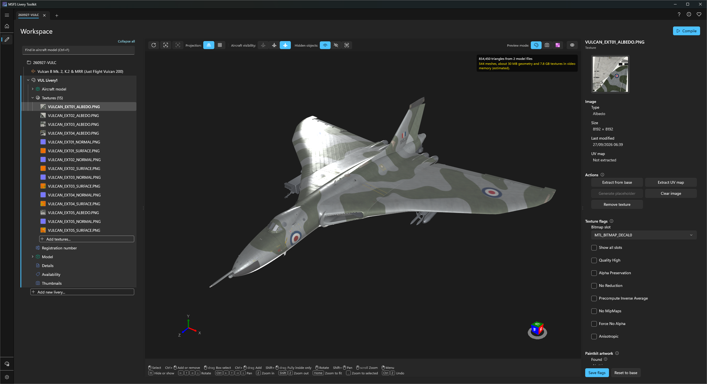
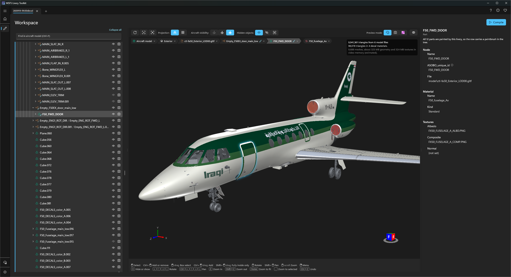
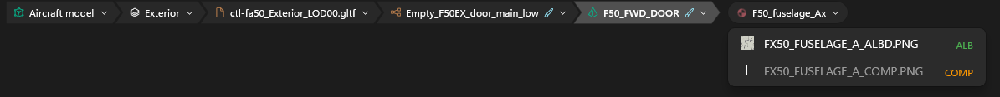
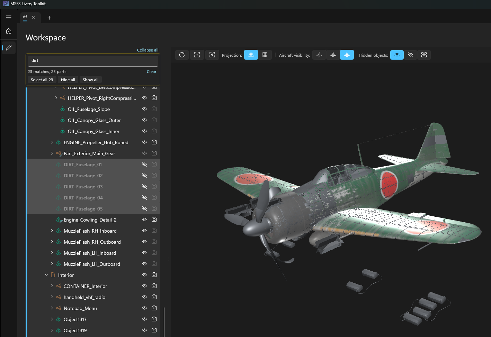

# The Workspace
{: .no_toc }

Everything you do with a project happens on one page, the **Workspace**: your project as a tree on the left, the aircraft in 3D in the middle, and the properties of whatever you have selected on the right.

1. TOC
{:toc}

---

## The tree

Everything in the project is one tree:

- **The project** at the top. Select it to edit the project's title and its package details, the fields that go into `manifest.json`. They save as soon as you leave each box, and the app re-reads `manifest.json` first, so an edit you made to that file by hand is never overwritten.
- **Each livery** below it. One livery is *loaded* at a time: it is the one you are working on, the one drawn in the viewport, and it is marked by an accent bar down the left edge of its rows. Double-click another livery, or right-click it and choose **Load livery**, to switch.
- **Under the loaded livery**, one node for each part of a livery:
  - **Aircraft model**: every part of the aircraft, with controls to hide parts from the preview and from your thumbnails. See [The viewport](#the-viewport).
  - **Model**: your own 3D decal model, if the livery has one. See [Mesh liveries]({{ '/mesh-liveries.html' | relative_url }}).
  - **Textures**: one row per texture, each with a small thumbnail of your artwork. Hover a row for a larger preview. See [Creating liveries]({{ '/creating-liveries.html' | relative_url }}).
  - **Thumbnails**, **Registration number**, **Details** and **Availability**.
- **Add new livery...** is always the last row under the project, and **Add textures...** the last row in every Textures folder.

Select any row and its properties appear on the right. Right-click it for everything you can do with it. Icons are coloured by type, the way Blender colours its outliner; if you prefer plain icons, turn on **Monochrome icons** in [Settings]({{ '/configuration.html' | relative_url }}).

Opening a project takes you back to the row you last had selected, or to the loaded livery's Textures folder. A project with no liveries yet goes straight into adding one.

### Opening folders in Windows Explorer

Right-click the row the folder belongs to:

- **The project row**: Open workspace folder, Open built package folder, Open base aircraft folder.
- **A livery row**: Open livery artwork folder, Open deployed livery folder.
- **Aircraft model**: Open base aircraft folder.

Folder paths shown in the properties panel also have their own **Copy** and **Open** buttons.

### Deleting a livery

**Delete livery...** is the last item when you right-click a livery, behind a red confirmation. It removes the livery from the project, deletes its built folder and deletes its source artwork.

---

## The viewport

The middle of the Workspace shows the aircraft in 3D, with your own artwork on it. It updates by itself when your artwork changes in the app, after **Extract from base**, **Generate placeholder** or **Clear image**. After saving a repaint in Photoshop, select **Refresh** on the viewport's toolbar.

If the model is not loaded yet, select **Load aircraft model**. Large aircraft take several seconds to read, and the rest of the app stays usable meanwhile. [Settings]({{ '/configuration.html' | relative_url }}) can load it for you whenever a project opens.

- **Click a part** to select it. Its row is revealed in the tree, and its name, model file, material and textures appear on the right. Selecting a row in the tree selects the part in the viewport too.
- **Ctrl-click** adds a part to the selection or takes it out. **Drag a box** to select everything it touches; hold **Shift** to take only parts entirely inside the box, or **Ctrl** to add to the selection. Clicking empty space clears it.
- **Parts your livery paints** carry a small paintbrush on their icon in the tree: a full one on a painted part, a faded one on a group that holds some painted parts.

### Hiding parts

Every part in the Aircraft model node has two columns:

- **The eye** hides a part from the preview, so you can see past it while you paint. It never changes what gets built.
- **The camera** leaves a part out of your rendered thumbnails, for example ground equipment, covers or a pilot.

**H** hides or shows the selected parts, **Ctrl+Z** undoes, and the viewport's right-click menu does the same. **Restore all painted parts** on the Aircraft model row brings back any painted part you hid. Your choices are remembered per aircraft.

### Preview modes

The toolbar switches between three views of the same aircraft:

- **Livery preview**: your artwork, with the eye column's hidden parts left out.
- **Thumbnail preview**: exactly the parts your rendered thumbnails will include. Here **H** hides a part from the thumbnails.
- **Coverage preview**: colours every part by where its textures come from: your livery, the base aircraft, or nowhere, using the simulator's own pink for anything missing. See [Texture fallbacks]({{ '/creating-liveries.html' | relative_url }}#texture-fallbacks).

Elsewhere on the toolbar:

- **Hidden objects** shows **both** visible and hidden parts (hidden ones ghosted), **only visible** parts, or **only hidden** parts, which is the quickest way to bring back something you hid by mistake.
- **Aircraft visibility** draws the rest of the aircraft as solid grey, a faint ghost, or not at all.
- **Projection** switches between perspective and orthographic, a flat view with no foreshortening for judging whether a stripe is straight.
- **Zoom to fit** and **Zoom to selected** frame the view, and **Refresh** re-reads your painted textures and your decal model after you save or re-export them.

### Display options

- **Shading**: Wireframe, and Colour by material, which gives every material its own colour.
- **Lighting**: Studio, Even and Dramatic, all of which light the underside too, so you can check gear bays and belly panels.
- **Normal depth**: how strongly normal maps are applied. Turn it down until it matches what you see in MSFS.
- **Model alignment**: how your own decal model is placed. See [Mesh liveries]({{ '/mesh-liveries.html' | relative_url }}).
- **Tree**: **By file** lists every part under its model file. **Node hierarchy** lists them the way the aircraft's developer built them, each part under the node it hangs from. Long chains of empty nodes are merged into one row, and hiding a part hides everything inside it.
- **Statistics**: the triangle count, model files, meshes and estimated video memory, in the corner of the view. The memory figure always shows, and turns amber if the scene is getting heavy.

Glass is drawn see-through and glossy in every view, so windows never hide the cockpit.

{: .note }
> Parts your livery does not repaint are shown in plain grey, not in the aircraft's own paintwork. In the simulator those parts fall back to the base aircraft's textures, so the preview answers "where does my paint land, and is it the right way up" rather than "what will this aircraft look like on the ramp".

### The breadcrumb

When you select a part, a row of arrow-shaped chips appears at the top of the viewport showing where it sits: the part, the node it hangs from, its model file and the aircraft.

- **Click a chip** to select that level. **Double-click** to zoom to it.
- **The small arrow** in each chip lists what is inside it. Hover an entry to see it highlighted on the aircraft.
- After a single part, a **material chip** lists the textures that part uses. A texture already in your livery takes you to its row; one that is not opens Add textures with it already selected.
- **Right-click a chip** for the same menu as its row in the tree. **Alt+Up** selects the level above, and **Esc** clears the selection.

### Find in aircraft model

**Ctrl+F**, or the box above the tree, finds parts by name. Type part of a name and every match is outlined on the aircraft, with a count. Then **Select all**, **Hide all** or **Show all** act on every match at once, and each is one step for Ctrl+Z.

---

## Mouse and keyboard

The mouse and key hints are always along the bottom of the viewport. The full set:

| Action | Mouse | Keyboard |
|---|---|---|
| Rotate | Middle button drag | Arrow keys |
| Pan | Shift + middle button drag | Ctrl + arrow keys |
| Zoom | Wheel | Z to zoom in, Shift+Z to zoom out |
| Frame the whole aircraft | | Home |
| Frame the selection | | Full stop |
| Select | Left click, Ctrl-click to add or remove, drag a box | |
| Hide or show the selection | Right-click menu | H |
| Undo | | Ctrl+Z |
| Find parts by name | | Ctrl+F |
| Select the level above | | Alt+Up |
| Clear the selection | Click empty space | Esc |

The keyboard controls work on a trackpad, which has no middle button.

---

## Tasks

Adding a livery and adding textures are guided **tasks**. While one runs, the task's own list takes the tree's place and the viewport stays beside you, set up for the job. **Previous** and **Next** move between steps without losing anything; **Esc** or the back arrow cancels. See [Creating liveries]({{ '/creating-liveries.html' | relative_url }}).

**Compile**, at the top of the Workspace and on the project row's right-click menu, opens the build screen in place of the Workspace. The back arrow, the project name at the top, or **Esc** returns you to where you were. See [Compiling]({{ '/compiling.html' | relative_url }}).

---

## Messages and saving

Status and warning messages float over the top right of the viewport, so nothing jumps as they appear. A success message closes itself after a few seconds (hover it to keep it). Warnings stay amber and errors red until you close them.

Almost everything saves as you make the change: the project's details when you leave a box, fallbacks, availability tags once confirmed, registration numbers and textures straight away. The few settings that wait for you (Details, texture flags, the paintkit path and Availability) have their own Save button at the bottom of the properties panel, and **Ctrl+S** presses it for you.
